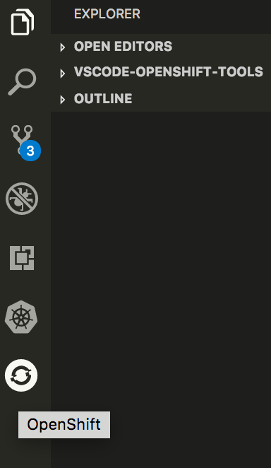
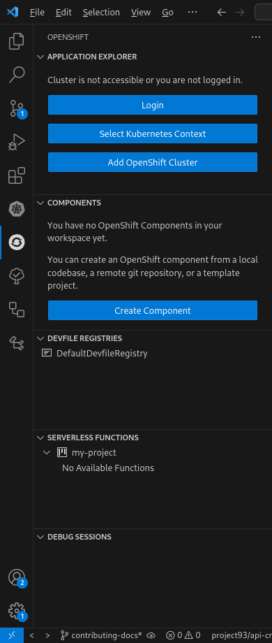
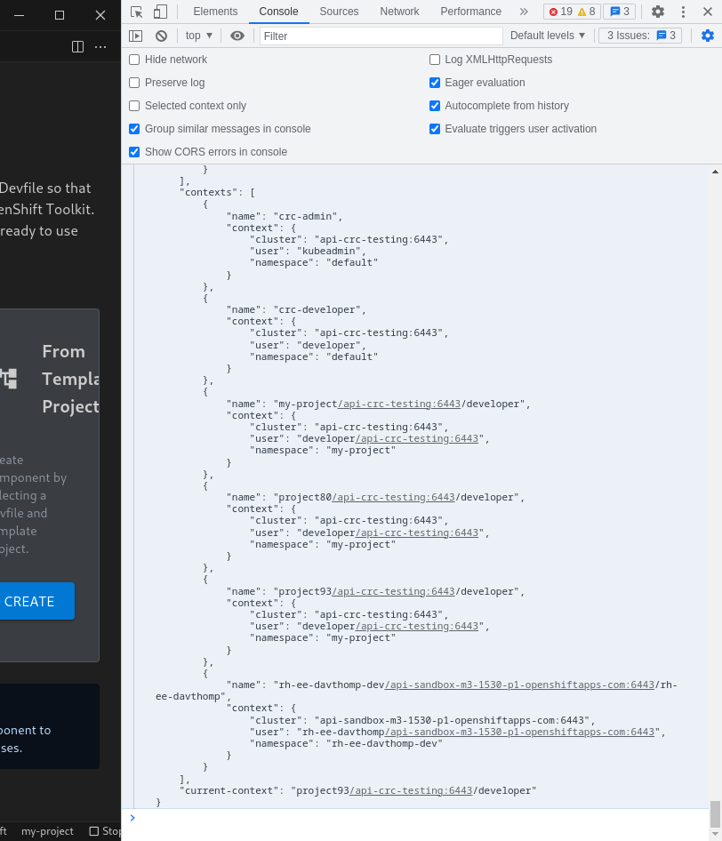

# How to contribute

Contributions are essential for keeping this extension great.
We try to keep it as easy as possible to contribute changes and we are
open to suggestions for making it even easier.
There are only a few guidelines that we need contributors to follow.

## First Time Setup
1. Install prerequisites:
   * latest [Visual Studio Code](https://code.visualstudio.com/)
   * [Node.js](https://nodejs.org/) v16.17.0 or higher
     * It is recommended to set up `nvm` to manage different versions of node, which can be installed by following the instructions [here](https://github.com/nvm-sh/nvm#installing-and-updating).
     * To use the current recommended version for this project (in`./nvmrc`), run `nvm use`.

2. Fork and clone the repository
3. `cd vscode-openshift-tools`
4. Install the dependencies:

	```bash
	$ npm install
	```
5. Open the folder in VS Code

## Run and debug the extension locally

1. Build with the following command at least once before running in debug mode:

   ```bash
   $ npm run build
   ```

   * This downloads the `oc` and `odo` binaries and compiles the code.
2. The extension can now be launched with the `Extension` launch option in the Run and Debug tab (`Ctrl+Shift+D`) in VS Code.
   * Note: breakpoints in webview code will not work
3. After making any changes, consider the following before relaunching the extension to ensure the changes are recompiled:
   * Changes in version of one of the required tools in `src/tools.json`, run:

      ```bash
      $ npm run bundle-tools
      ```

   * Any other changes should be recompiled automatically by the VS Code prelaunch task.
     * The launch will be prevented if there are compilation errors.
4. Once the extension is launched in debug mode, there will be an OpenShift icon in the Sidebar:



When you click on it, you should see the following view:



## Debugging webviews

The first thing to note about webviews is that breakpoints set in VS Code in the webview code won't work.
This is because the extension code and the webview JavaScript are run in separate processes.
Any code in a `.tsx` file or under `./src/webview/common` is webview code.
Note that not all the code under `./src/webview` is webview code;
some of it is code used on the extension side in order to load and interact with the webview.

In order watch or inspect values in webview code,
it's easiest to use `console.log()` statements.
The output from these statements can be inspected by opening Chrome debug tools
(by running the command "Developer: Toggle Developer Tools"),
then selecting the "Console" tab.



The Chrome debug tools can also be used to help with writing the layout of webviews.
In order to inspect the layout, switch to the "Elements" view.
Then, you will need to walk through the tree in order to locate the webview HTML.
It should be nested in two `<iframe>` elements (in order to sandbox it from the rest of VS Code).
It will look something like this:


Then, you can modify the CSS and attributes of elements in order to experiment with the layout of the webview.

## Running the tests

### Running the unit test suite

You don't need to be connected to a cluster in order for the tests to work properly.
In order to run the unit test suite, run:
```
npm test
```

In order to run the UI test suite and collect test coverage information, run:

```
npm run test:coverage
```

### Running the UI tests

There are two sets of UI tests: ones that don't require a connection to a cluster,
and ones that do require a connection to a cluster.

In order to run the UI tests that don't require a cluster,
make sure that you aren't logged into any cluster by running `oc logout`,
then run:

```
npm run public-ui-test
```

In order to run the cluster-dependant UI tests,
you need an OpenShift cluster where you can create and delete projects.
This means that OpenShift Developer Sandbox won't work.
`minikube`, `kind`, and MicroShift clusters also won't work,
since the UI tests some OpenShift-specific features,
such as logging in to the cluster.
The tests will create and delete resources on the cluster,
so please make sure nothing important is running on the cluster.

Then, you need to configure the following environment variables to point to your cluster:
- `CLUSTER_URL`: the URL pointing to the API of the cluster, defaults to `https://api.crc.testing:6443` (the default `crc` address)
- `CLUSTER_USER`: the username to use to login to the cluster, defaults to `developer`
- `CLUSTER_PASSWORD`: the password to use to login to the cluster, default to `developer`

Note that if you are running `crc`, the defaults should work.

Once, you've configured your cluster, run:

```
npm run cluster-ui-test
```

### Running the Integration Test Suite

In order to run the integration test suite, you need access to an OpenShift cluster
where you can create and delete projects.
Unfortunately, this means that OpenShift Developer Sandbox instances won't work.
Also, non-OpenShift Kubernetes distributions, such as `minikube`, will not work, since we test many OpenShift-specific features.
One way to access such a cluster is by using [crc](https://crc.dev/crc/) to run an OpenShift cluster locally on your computer.
The tests will create and delete resources on the cluster,
so please make sure nothing important is running on the cluster.

First, set the following environment variables to point the tests to your cluster:
- `CLUSTER_URL`: the URL pointing to the API of the cluster, defaults to `https://api.crc.testing:6443` (the default `crc` IP address)
- `CLUSTER_USER`: the username to use to login to the cluster, defaults to `developer`
- `CLUSTER_PASSWORD`: the password to use to login to the cluster, default to `developer`

Then, run `npm run test-integration`.

If you would like to generate a coverage report of the integration test suite,
you can run `npm run test-integration:coverage`.

> If you have any questions or run into any problems, please post an issue - we'll be very happy to help.

### Certificate of Origin

By contributing to this project you agree to the Developer Certificate of
Origin (DCO). This document was created by the Linux Kernel community and is a
simple statement that you, as a contributor, have the legal right to make the
contribution. See the [DCO](DCO) file for details.
