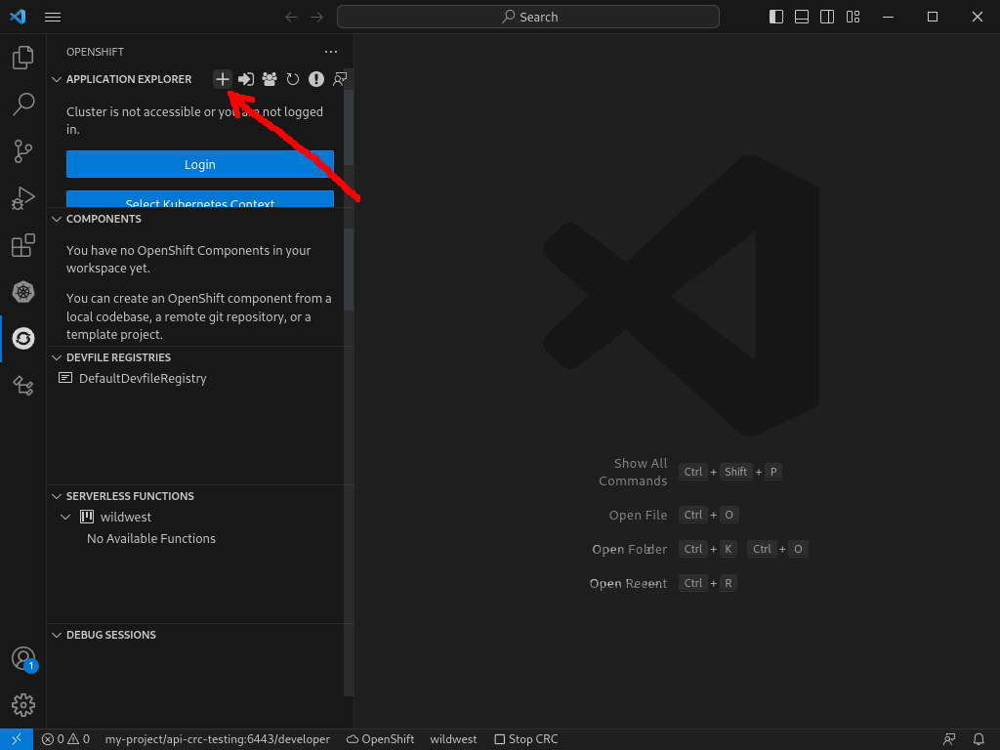
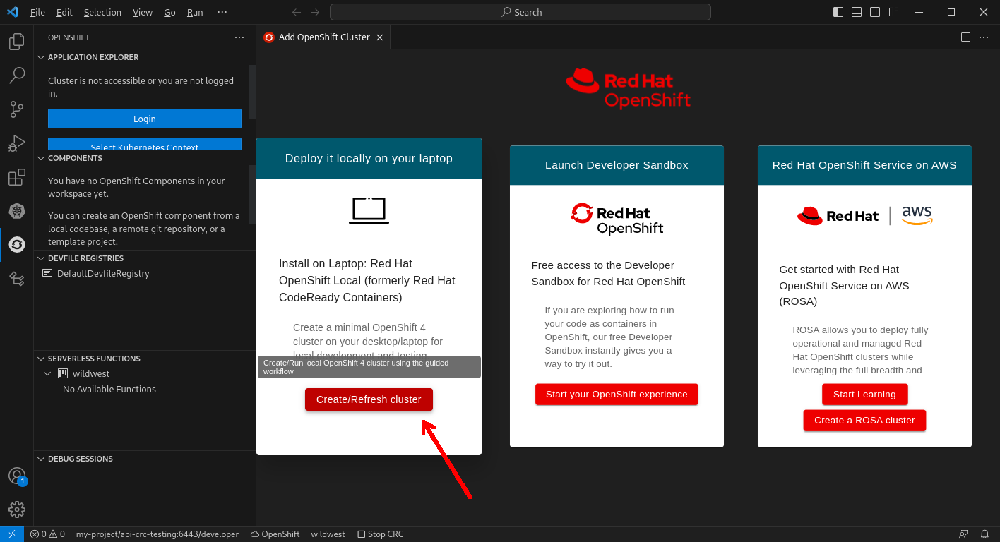
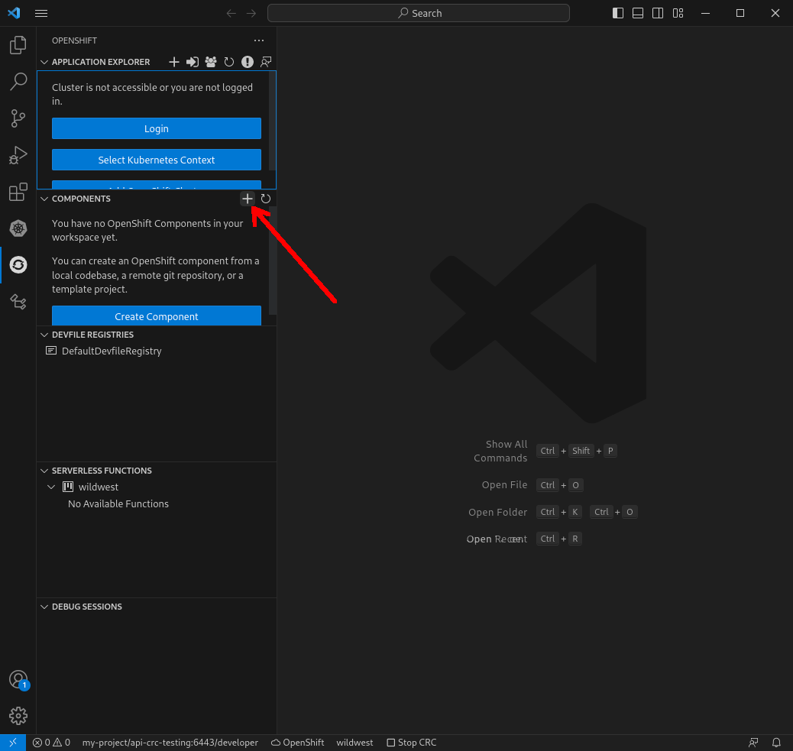
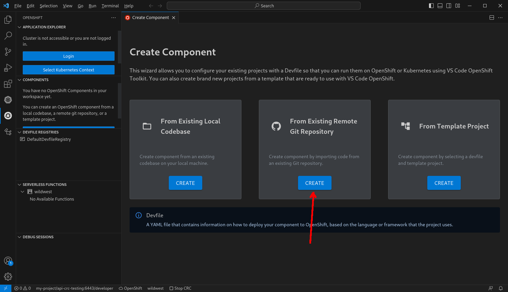
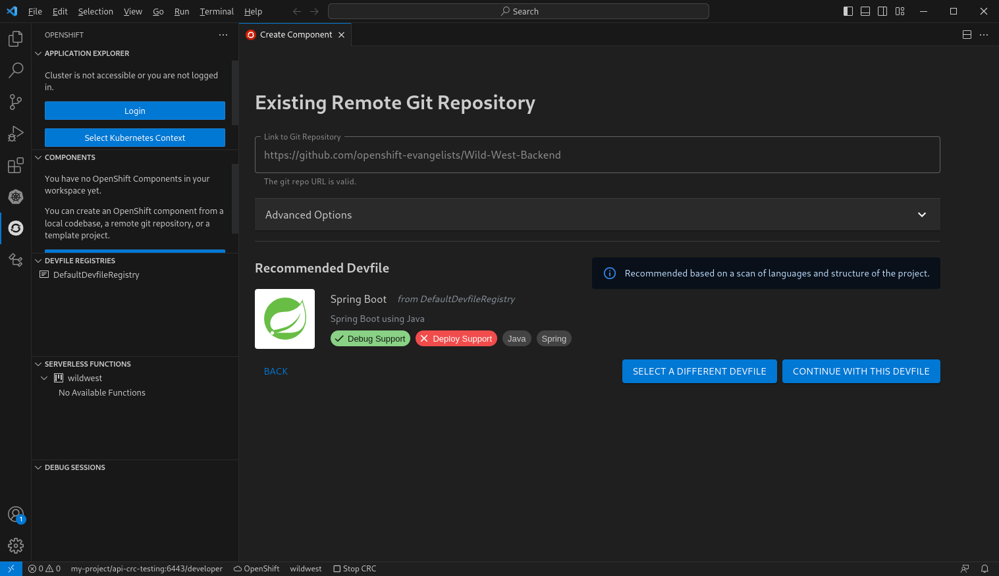
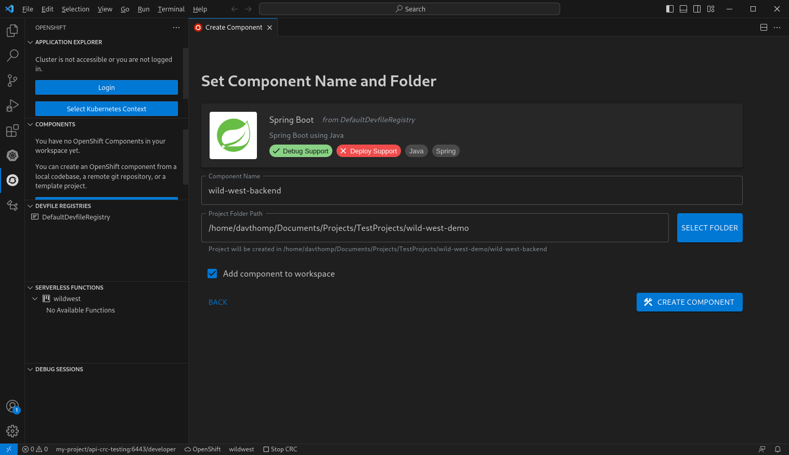
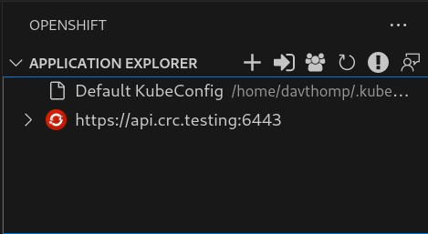
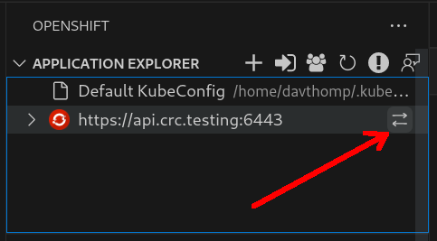

# Wild West Demo App Walkthrough

This document explains how to use VS Code OpenShift Toolkit
by walking through how to deploy the [Wild West demo app](https://github.com/openshift-evangelists/Wild-West-Frontend)
to a locally running OpenShift cluster using the extension.
You'll provision the cluster,
set up the components to be run in dev mode,
run the components on the cluster,
and then connect the components,
resulting in the functional app.

## Prerequisites

To get started, you will need:
- `git`
- `oc`, the OpenShift Client command line tool (download `openshift-client-$PLATFORM.tar.gz` from [this website](https://mirror.openshift.com/pub/openshift-v4/x86_64/clients/ocp/latest/))
- [VS Code](https://code.visualstudio.com/)
- [VS Code OpenShift Toolkit](https://marketplace.visualstudio.com/items?itemName=redhat.vscode-openshift-connector) (available through the VS Code or open-vsx extension marketplace)
- A computer with 32 GB RAM (to ensure that the local OpenShift cluster runs smoothly)

Nice to have:
- [VS Code YAML](https://marketplace.visualstudio.com/items?itemName=redhat.vscode-yaml) for modifying YAML files (available through the VS Code or open-vsx extension marketplace).

## Application Architecture

The Wild West demo application is a game in the form of a web app.
The objective of the game is to shoot at the Kubernetes objects that are automatically regenerated (such as pods),
and avoid shooting the ones that can't be regenerated.
The list of Kubernetes objects that appear in game come from the cluster that the game is being run on.

The game consists of two components:
- A Spring Boot application that exposes a REST service to get information about the OpenShift cluster
- A NodeJS ([Express](http://expressjs.com/)) application that serves the website (HTML, CSS, JS) at `/` and forwards requests under the `/ws/` path to the Spring Boot service
  - As a result, the user's browser doesn't need direct access to the Spring Boot application

## Starting the Cluster

The first step in running the application is getting the cluster up and running.
Luckily, VS Code OpenShift Toolkit provides a wizard to help us with this.
First, open the OpenShift Sidebar.
Then, press the "+" button at the "Application Explorer" section:



A wizard for creating a cluster will pop up.
Press the "Create/Refresh Cluster" in the first card:



Follow through the instructions in order to start the local OpenShift cluster.
Note that it will take around 15 minutes in order to start the cluster.

## Cloning the Components

While we are waiting for the cluster to start,
we can clone the different components that the project needs so that they are locally accessible.

In order to ensure that the projects can be debugged on OpenShift,
VS Code OpenShift Toolkit needs a configuration file called a [Devfile](https://devfile.io)
to explain how to build and run the application.
VS Code OpenShift Toolkit comes with a wizard in order to facilitate cloning a project and adding an appropriate Devfile.

To start off, let's clone the project for the backend component.
Open the OpenShift Sidebar, press the "+" button at the top of the "Components" section:



Then, in the wizard that appears, select "From Existing Remote Git Repository" (the second card):



Now, enter the following URL into the text field for the git repository, then click next:

```
https://github.com/openshift-evangelists/Wild-West-Backend
```

You should see that it detects that the Devfile for Spring Boot is most appropriate:



Select "Continue With This Devfile",
then enter a name for the project and the parent folder for where the repo should be cloned into.



Press "Create Component".
After a few seconds, you should see the project added to VS Code's file explorer,
as well as under the OpenShift sidebar's "Components" section.

For the frontend,
you can clone the repo as you normally would,
since it already has a Devfile setup.
Currently, the Create Component UI **doesn't work properly for projects that already have a Devfile**,
[but we are working on fixing this](https://github.com/redhat-developer/vscode-openshift-tools/issues/3104).
Clone the following repo:

```
https://github.com/openshift-evangelists/Wild-West-Frontend
```

## Fix  the Frontend Devfile

Unfortunately, as it stands, the Devfile for the frontend won't work properly
(at least as of [this commit](https://github.com/openshift-evangelists/Wild-West-Frontend/commit/f3e0b2fe5a90acfb6ea1706e14d1a916ae090e91)).
We need to modify a few things in the frontend code base to get it working.

The first of these is renaming the component from the generic name to something more descriptive by modifying the Devfile:

```diff
diff --git a/devfile.yaml b/devfile.yaml
index 4f86869..bcacf7c 100644
--- a/devfile.yaml
+++ b/devfile.yaml
@@ -39,7 +39,7 @@ components:
     sourceMapping: /project
   name: runtime
 metadata:
-  name: nodejs
+  name: wild-west-frontend
   version: 2.0.0
 schemaVersion: 2.0.0
 starterProjects:
```

Now it should appear in the OpenShift sidebar as "wild-west-frontend".

Next is getting the debug mode working properly.
Take a look at the `.commands` section of the Devfile.
This section specifies the different commands that are used to run, build, or debug the project.
You should see one of the commands listed as the default debug command:

```yaml
# line 18
- exec:
    commandLine: npm run debug
    component: runtime
    group:
      isDefault: true
      kind: debug
    workingDir: /project
  id: debug
# ...
```

The debug command is run by VS Code OpenShift Toolkit in order to start the component in debug mode.
In this case, it's set up to run `npm run debug`.
However, if you look in the `package.json`, there is no corresponding `"debug"` script.
For now, we can make a `"debug"` script that's a copy of the `start` script:

```diff
diff --git a/package.json b/package.json
index c90dc29..9984069 100644
--- a/package.json
+++ b/package.json
@@ -5,6 +5,7 @@
   "main": "server.js",
   "scripts": {
     "start": "node server.js",
+    "debug": "node server.js",
     "test": "echo \"Error: no test specified\" && exit 1"
   },
   "repository": {
```

Finally we need to ensure we can access the application from outside of the cluster.
VS Code OpenShift provides a mechanism that exposes
a service being run on the OpenShift cluster
through a localhost port.
In order to set this up, we need to specify which ports should be exposed.
This application serves HTTP request on port `8080`,
so we should use the following configuration:

```diff
diff --git a/devfile.yaml b/devfile.yaml
index 4f86869..0b8d960 100644
--- a/devfile.yaml
+++ b/devfile.yaml
@@ -37,6 +37,10 @@ components:
     memoryLimit: 1024Mi
     mountSources: true
     sourceMapping: /project
+    endpoints:
+    - name: nodejs
+      targetPort: 8080
+      exposure: internal
   name: runtime
 metadata:
   name: wild-west-frontend
```

## Prepare the cluster

By now, hopefully the cluster is up and running.
Once it's running, you should see the following in the OpenShift side bar under the application section:



Hover over the cluster, then select the "Change Active Project" button on the left:



Create a new project "wildwest" and change to it.

Now, open up the command line.
In order for the Spring Boot backend to work,
it needs access to a service account that can read the state of the cluster.
In order to set this up, run the following command:

```bash
oc policy add-role-to-user view system:serviceaccount:wildwest:default
```

This modifies the permissions of the default service account for the "wildwest"
namespace to be able to read Kubernetes objects in the namespace.

## Start the Backend

In the "Components" section of the OpenShift sidebar,
right click on "wild-west-backend" and select "Start Dev".

This will open up a new terminal that runs the application on the OpenShift cluster.
It will take a while for the application to start;
watch the output to make sure its working.

When the application is running,
if you expand all the sections in the "Application Explorer" section of the OpenShift sidebar,
you should see a "Deployment" listed.
You should also see output related to forwarding requests to the pod.
It should list an address of the form `localhost:XXXXX`,
where the port is dynamically assigned based on what is available.
When you see this, navigate to the following website:

```
https://localhost:$PORT/egg
```

replacing `$PORT` with the port from the console output.
You should see the following text:

```
Every game needs an easter egg!!
```

Now, the backend is running in dev mode.
When you are running dev mode, any changes that you make to the source code will be applied to the app running on the cluster.
Try modifying the response message for the easter egg endpoint in the backend code:

```diff
diff --git a/src/main/java/com/openshift/wildwest/controllers/APIController.java b/src/main/java/com/openshift/wildwest/controllers/APIController.java
index a8e68e0..08e1599 100644
--- a/src/main/java/com/openshift/wildwest/controllers/APIController.java
+++ b/src/main/java/com/openshift/wildwest/controllers/APIController.java
@@ -38,7 +38,7 @@ public class APIController {

        @RequestMapping("/egg")
        public String easterEgg() {
-               return "Every game needs an easter egg!!";
+               return "This game has an easter egg!!";
        }

        @RequestMapping("/objects")
```

You should see that the terminal responds by reloading the code into the container and rebuilding the application
(this might take a while).
Once it's done, if you go back to the endpoint, you will get your updated response.

Now, let's set up the frontend to interact with our code.

## Connecting the Services

*This section is going to take a few technical detours so bear with me.
I learned a lot of the concepts needed to get this working from [Parthvi's blog about doing something similar](https://odo.dev/blog/binding-database-service-without-sbo/)*

The frontend code needs to know how to contact the backend.
In the Wild West demo app, this is configured by passing two environment variables to the frontend component:
- `$COMPONENT_BACKEND_HOST`
- `$COMPONENT_BACKEND_PORT`

This method of connecting services is a simple, standard method,
and is mentioned in [The Twelve-Factor App](https://12factor.net/config).
However, this leaves us with two questions:

### What host and port should we use?

A Kubernetes cluster (such as OpenShift) has its own network.
The frontend and backend components will both be in that network,
so they can communicate with each other over it.

VS Code OpenShift Toolkit automatically creates a Kubernetes `Service` object
when running your component in dev mode.
A [Service](https://kubernetes.io/docs/concepts/services-networking/service/)
object is a way of exposing a `Deployment` to the Kubernetes internal network.
A [Deployment](https://kubernetes.io/docs/concepts/workloads/controllers/deployment/)
manages running an application and can horizontally scale the application.
Please refer to the linked documentation for more accurate technical descriptions of these concepts.
In our case, the name of the `Service` object is the same as the name of the `Deployment`,
and we can find the name of the `Deployment` in the "Application Explorer" section in the OpenShift sidebar.

On a Kubernetes cluster with DNS support (such as OpenShift),
if we are trying to access a `Service` that's in the same namespace as the current application,
we can use the `Service`'s name as the host name.
This is noted in the Kubernetes "Services Networking" documentation,
under the [DNS section](https://kubernetes.io/docs/concepts/services-networking/service/#dns).

This means we can use the name of the backend `Service`, `wild-west-backend-app`, as our hostname.
The port remains `8080`,
which is the same value as if the application were running on `localhost`.

### Where do we set the host and port name?

Devfiles contain a field to pass environment variables into containers that are created when running dev mode.

The backend host and port config won't change from cluster to cluster or workspace to workspace,
since the name of the backend is the only thing that determines the host name.
As a result, we are safe to add these directly to the Devfile
and can commit these changes into the git repo.

Add the following to the frontend `devfile.yaml`:
```diff
diff --git a/devfile.yaml b/devfile.yaml
index 44070b3..672e2f4 100644
--- a/devfile.yaml
+++ b/devfile.yaml
@@ -41,6 +41,11 @@ components:
     - name: nodejs
       targetPort: 8080
       exposure: internal
+    env:
+    - name: COMPONENT_BACKEND_HOST
+      value: wild-west-backend-app
+    - name: COMPONENT_BACKEND_PORT
+      value: '8080'
   name: runtime
 metadata:
   name: wild-west-frontend
```

## Start the Frontend

Start the frontend component in dev mode the same way that you started the backend component.
Once the component is ready, navigate to the URL it provides.
You should see that the game is fully functional.
Make sure to try it out.

**YEE HAW!**


